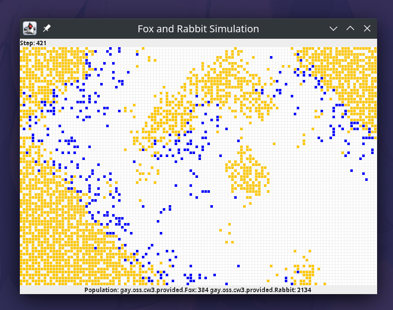

# Coursework 3: Predator / Prey Simulation

### World Overviews

### Close Ups

### User Interface

### Original Project

Below is a picture of what they gave us to work with, we threw out most, if not all of the code and just made the thing above lol

## Project Guidelines

- Use [conventional commit style](https://www.conventionalcommits.org/en/v1.0.0-beta.2/).
