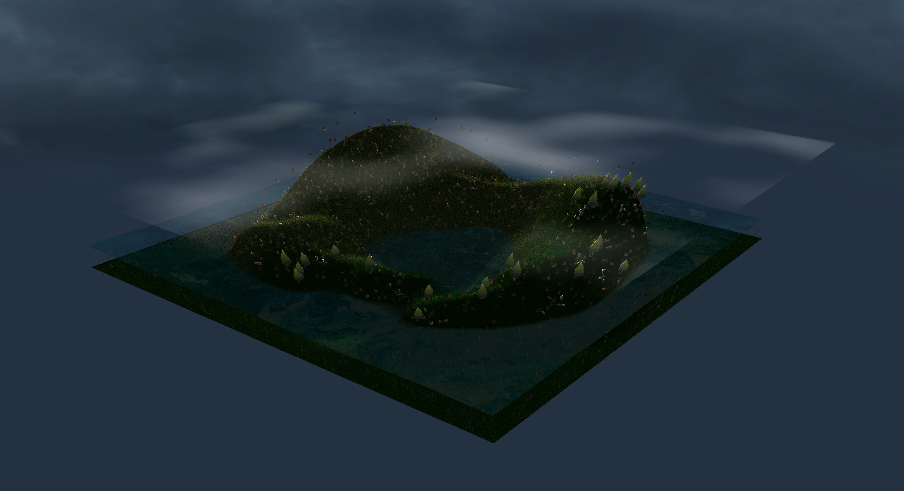
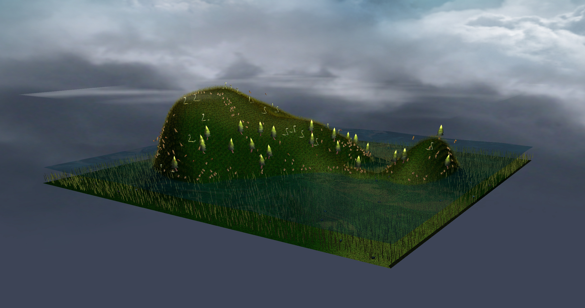
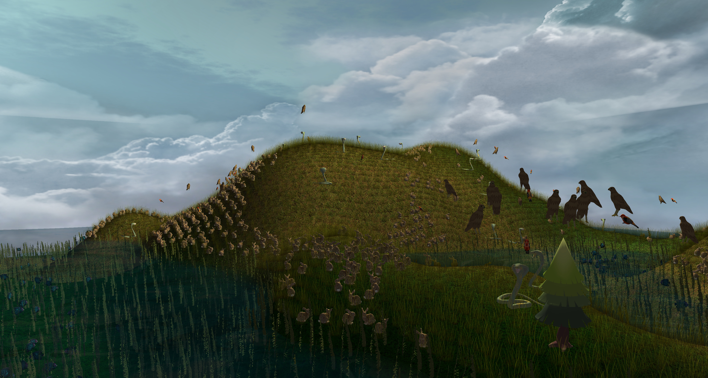
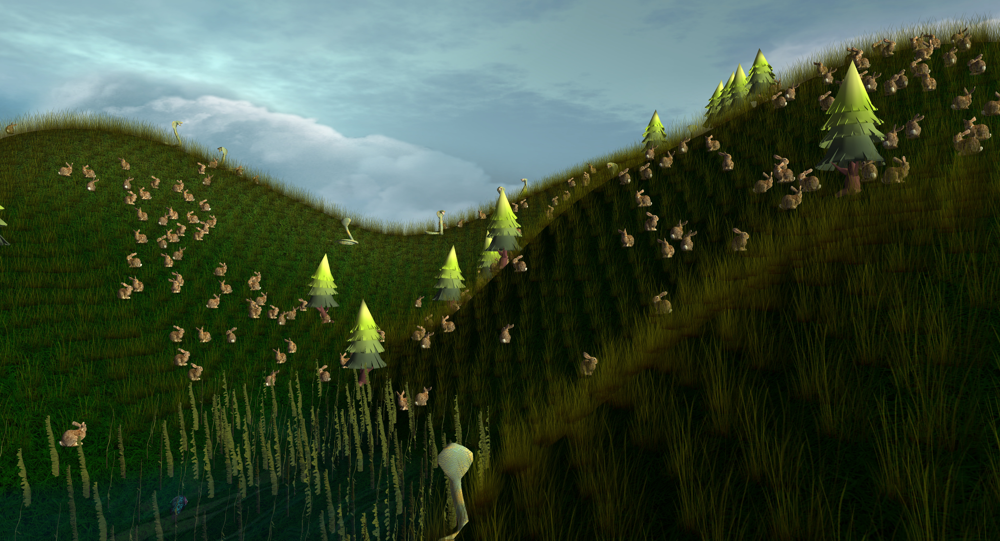
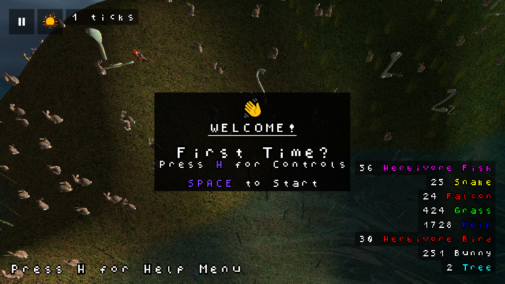
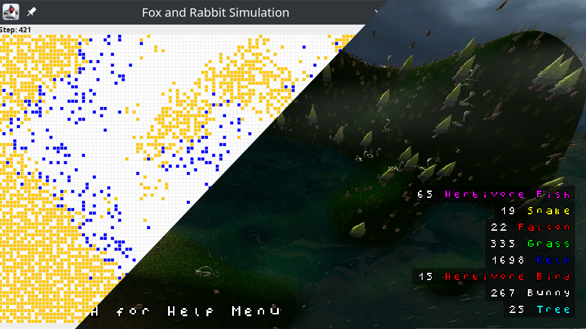

# Coursework 3: Predator / Prey Simulation

This project can be built with Gradle.

To build a jar for distribution (on current platform), run `gradlew shadowJar`.

### World Overviews

### Close Ups

### User Interface

### Original Project

Below is a picture of what they gave us to work with, we threw out most of the provided code and just went off to do our own thing really lol

## Project Guidelines

- Use [conventional commit style](https://www.conventionalcommits.org/en/v1.0.0-beta.2/).
